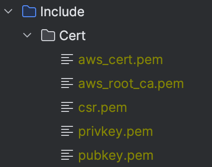
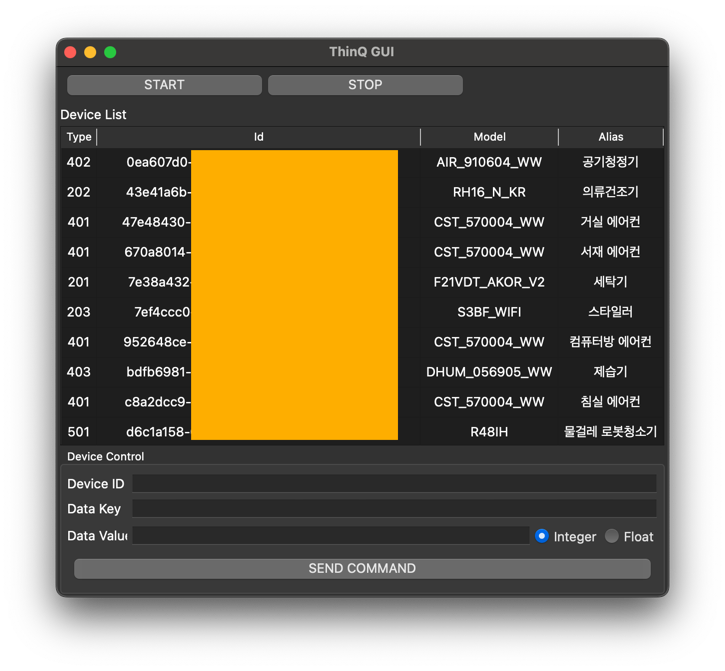
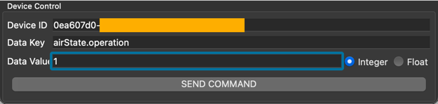

# python_thinq_api_tester
LG ThinQ API Test Application (python)

Clone repository
---
```shell
$ git clone https://github.com/YOGYUI/python_thinq_api_tester.git
```

Requirements
---
`Python` 3.7.x ~ 3.11.x (application is developed on 3.10.11 environment) <br>
Python Package below are necessary.
```text
requests
paho-mqtt
pyopenssl
PyQt5
```
```shell
$ pip install -r requirements.txt
```

Usage
---
1. Replace all required strings like refresh token, oauth secure key in main.py <br>
    ```python
    api_key = "replace to your api key"
    api_client_id = "replace to your api cliend it"
    refresh_token = "replace to your thinq refresh token"
    oauth_secret_key = "replace to your oauth secret key"
    app_client_id = "replace to your application client id"
    app_key = "replace to your application key"
    ```
    See [link](https://yogyui.tistory.com/408) to get these values from ThinQ API server.
2. Run application
    ```shell
    $ python3 main.py
    ```
3. Press **Start** button to initiate ThinQ API.<br>
    At first time, certification (`*.pem`) files will be downloaded on local storage (Include/Cert/) like below.<br>
    <br>
    When initialized, list of devices will be showed.
    <br>
4. Send command with `Data Key` and `Data Value`.<br>
    <br>

Notes
---
Only single home in ThinQ configuration is now available.<br>
(Multiple home configuration is not implemented)   